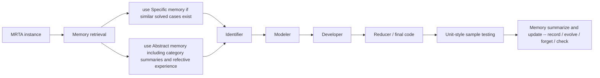

# EvoMem-MRTA

[](LICENSE)
[](#quick-start)

EvoMem-MRTA is a research codebase for memory-augmented LLM agents on multi-robot task assignment (MRTA) optimization problems. The repository combines a Chain-of-Experts style multi-agent solver with an evolving memory system that stores solved cases, abstracts successful and failed experiences, and reuses them across related MRTA task families.

## Highlights

- **Memory-augmented MRTA solving**: retrieve instance-level memories and category-level abstract summaries before solving a new task.
- **Multi-agent reasoning loop**: orchestrates `Identifier`, `Modeler`, and `Developer` agents, then synthesizes the final program with a reducer.
- **Online memory evolution**: successful runs are summarized into reusable memories, 
while failed runs are designed to offer refective experience. Moreover, memories can be updated, checked, scored, and forgotten over time.
- **Built-in evaluation benchmark**: includes 8 MRTA subsets with 25 problems each, for a total of **200 instances**.
- **Reproducible experiments**: provides entry points for single-run evaluation, batch runs, ablations, and cross-model comparison.

## Method Overview



At a high level, EvoMem-MRTA solves each benchmark instance as optimization code generation. The generated code is executed against task-specific samples, and the resulting trace is written back into memory to improve future runs.

## Benchmark

The repository ships with 8 MRTA subsets under [`dataset/`](dataset):

| Code | Meaning |
| --- | --- |
| `ST` | Single-Task robot |
| `MT` | Multi-Task robot |
| `SR` | Single-Robot task |
| `MR` | Multi-Robot task |
| `IA` | Instant Assignment |
| `TA` | Temporal Assignment |

Available subsets:

- `ST_SR_IA`
- `ST_MR_IA`
- `MT_SR_IA`
- `MT_MR_IA`
- `ST_SR_TA`
- `ST_MR_TA`
- `MT_SR_TA`
- `MT_MR_TA`

Each subset contains 25 problems. Every problem folder follows the same schema:

```text
dataset/<subset>/prob_k/
├── description.txt
├── code_example.py
└── sample.json
```

## Quick Start

### 1. Install dependencies

```bash
git clone <repo-url>
cd evomem_mrta
pip install -r requirements.txt
```

This project depends on `gurobipy`, so a working **Gurobi installation and license** are required.

### 2. Configure your LLM backend

Before running experiments, update the model backend settings to match your environment.

- The current code uses OpenAI-compatible chat endpoints in:
  - `agents/base_agent.py`
  - `agents/Identifier.py`
  - `Selector.py`
  - `Summarizer.py`
  - `agentic_memory_rb/llm_controller.py`
- `run_exp.py` also sets `HTTP_PROXY` and `HTTPS_PROXY` to `127.0.0.1:7890` by default.

If you are not using the same provider or local proxy, change these values first.

### 3. Run one MRTA instance

```bash
python run_exp.py \
  --dataset ST_SR_TA \
  --problem prob_0 \
  --algorithm coe \
  --model deepseek-ai/DeepSeek-V3
```

Useful flags:

- `--use true|false`: enable instance-level memory retrieval
- `--useab true|false`: enable abstract memory retrieval
- `--record true|false`: record new memories
- `--evolve true|false`: evolve abstract memory summaries
- `--forget true|false`: score and prune memories
- `--check true|false`: gate memory evolution with evaluation feedback
- `--max_collaborate_nums`: number of agent interaction rounds
- `--log_dir`: directory for run logs

### 4. Run the full benchmark

```bash
python run_exp_batch_insist.py
```

By default, this script iterates over all 8 subsets and 25 problems per subset, i.e. **200 tasks**.

## Experiments

### Ablation studies

The ablation helpers are under [`scripts/ablation/`](scripts/ablation).

- `run_no_memory.py`: disables memory retrieval and recording
- `run_no_record_80.py`: disables memory recording on 80 tasks
- `run_no_evolve.py`: disables abstract-memory evolution
- `run_no_forget.py`: disables score-based forgetting
- `run_no_check.py`: disables feedback-based checking

Example:

```bash
python scripts/ablation/run_no_memory.py
```

See [`scripts/ablation/README.md`](scripts/ablation/README.md) for the script list.

### Cross-model comparison

The multi-model helpers are under [`scripts/multi_model/`](scripts/multi_model).

- `run_multi_model_80.py`: runs 80 tasks across the configured models
- `run_multi_model_200.py`: runs 200 tasks across the configured models

Example:

```bash
python scripts/multi_model/run_multi_model_200.py
```

See [`scripts/multi_model/README.md`](scripts/multi_model/README.md) for details.

## Outputs

Each run writes a folder under `log/run_<algorithm>_<dataset>_<timestamp>/` with files such as:

- `*_original_answer.txt`: raw LLM output
- `*_generated_code.py`: extracted program
- `*_analysis.txt`: reasoning trace used for memory
- `*_using_memory.txt`: retrieved memory ids and levels
- `*_test_log.txt`: execution and sample-test results
- `*_summary.txt`: generated summary or error diagnosis
- `*_renew_summary.txt`: updated abstract memory summary

Persistent memories are stored under `agentic_memory_rb/memory/`.

## Repository Structure

```text
.
├── agents/                    # specialist agents used in the solving loop
├── agentic_memory_rb/         # memory storage, retrieval, and evolution
├── baseline/                  # baseline prompting and agentic methods
├── dataset/                   # 8 MRTA subsets, 200 total instances
├── scripts/ablation/          # ablation experiment helpers
├── scripts/multi_model/       # multi-model comparison helpers
├── main.py                    # Chain-of-Experts style solving pipeline
├── run_exp.py                 # main entry point for solving and evaluation
├── run_exp_batch_insist.py    # 200-task benchmark runner
└── test_generated_code.py     # execution-based evaluation
```

## Notes

- `run_exp.py` currently processes a **single problem name per call**. For large-scale evaluation, use `run_exp_batch_insist.py` or the helper scripts in `scripts/`.
- The benchmark is framed as **optimization code generation**: the model must produce executable Python and Gurobi code matching the function signature in each `code_example.py`.
- Category transfer in abstract memory is implemented with a simple distance over MRTA taxonomy codes, which enables reuse across related subsets such as `ST_SR_TA` and `MT_SR_TA`.

## License

This project is released under the [Apache-2.0 License](LICENSE).
